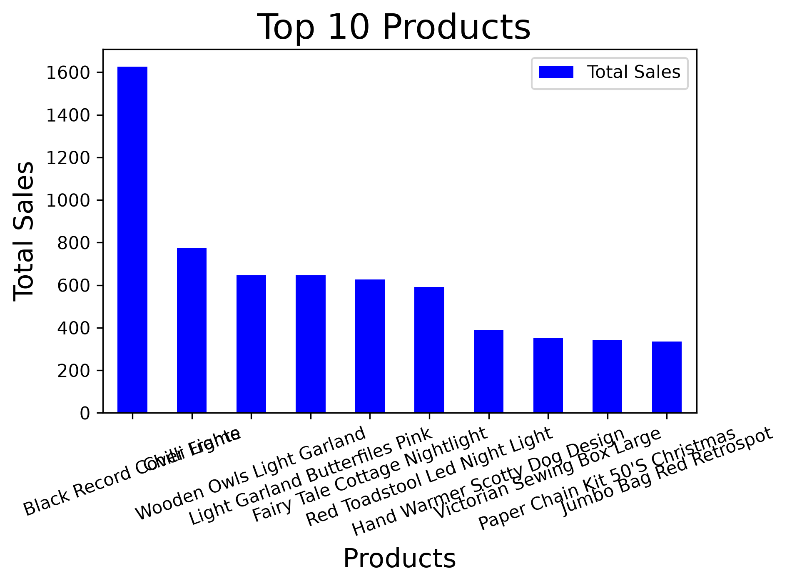
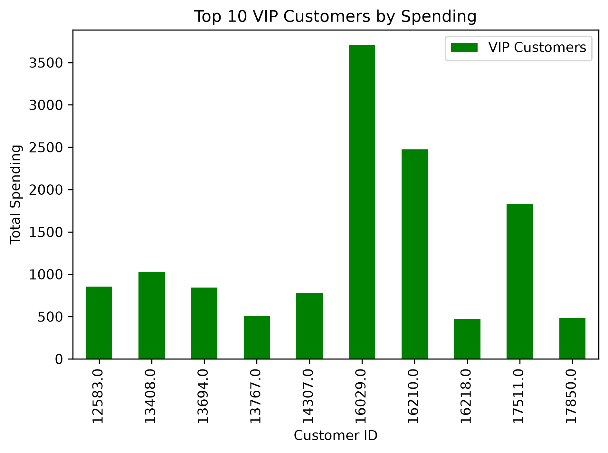
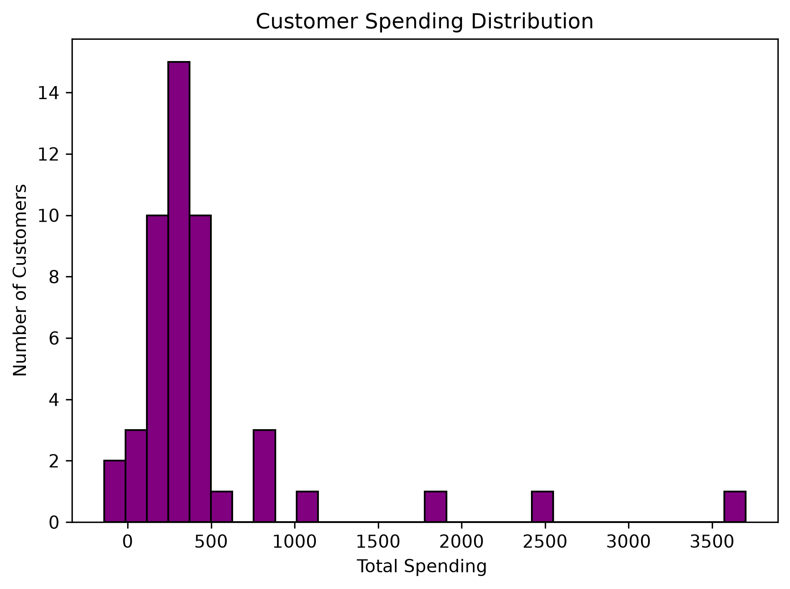
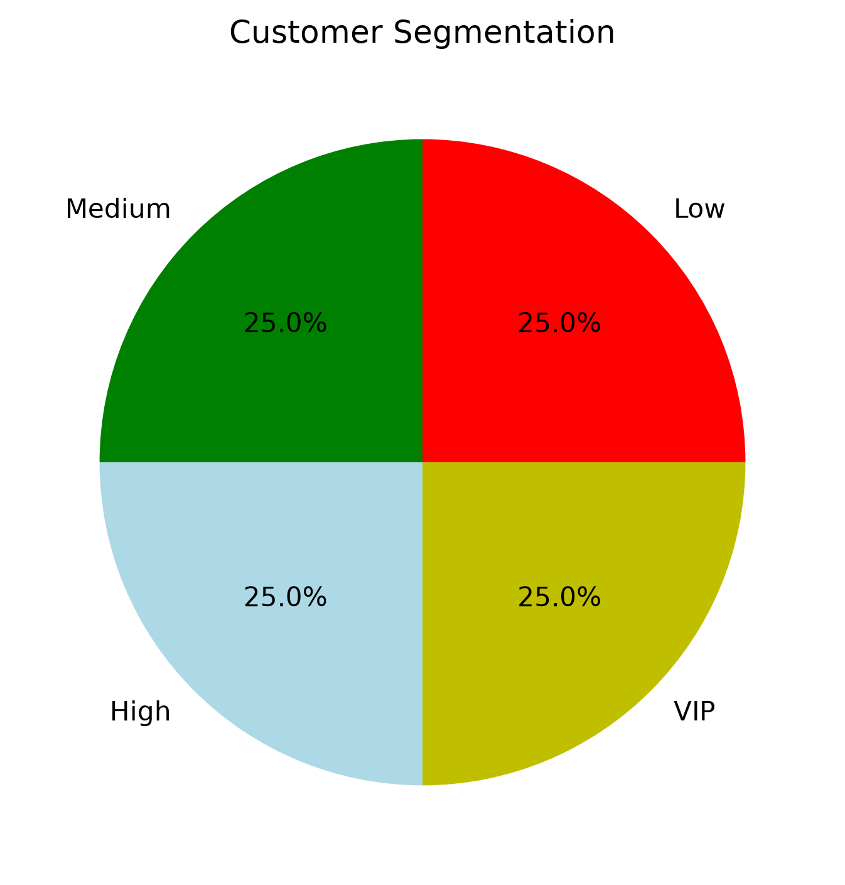
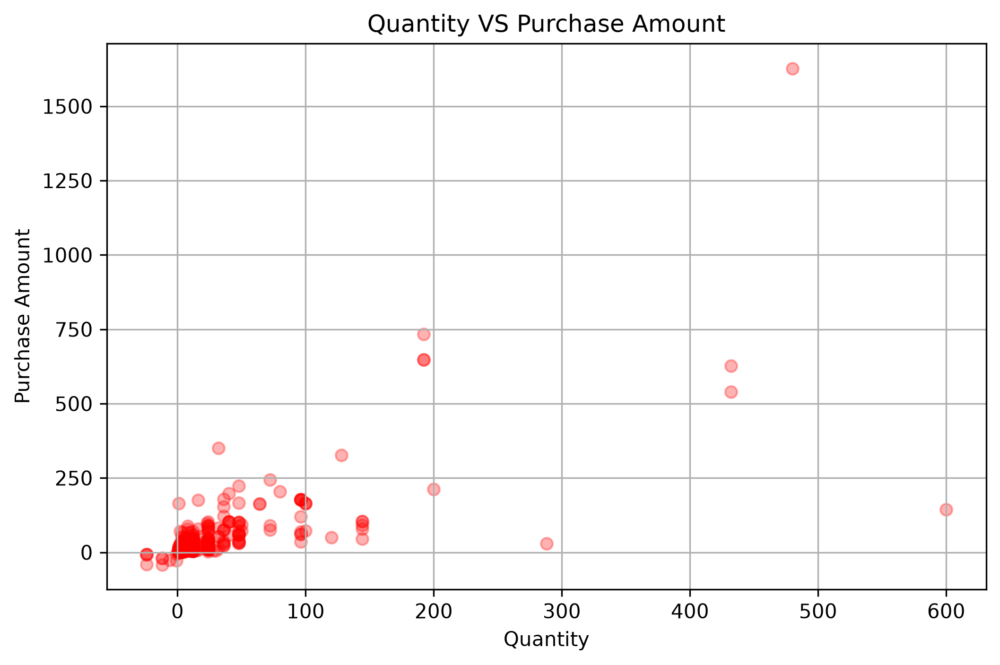

# E-Commerce Sales Analysis using Python

## Project Overview

This project performs Exploratory Data Analysis (EDA) on an E-Commerce dataset using Python. It focuses on data cleaning, statistical analysis, customer segmentation, product recommendations, and data visualization. The objective of the project is to extract meaningful business insights such as top-selling products, customer spending patterns, and VIP customers.

Through this project, I explored how Python libraries like Pandas, NumPy, and Matplotlib can be used to analyze real-world sales data efficiently.

---

## Technologies Used

- Python
- Pandas
- NumPy
- Matplotlib
- OpenPyXL

---

## Dataset Information

The dataset contains the following attributes:

| Column Name | Description |
|------------|-------------|
| CustomerID | Unique customer identifier |
| Description | Product name |
| Quantity | Number of products purchased |
| UnitPrice | Price per unit of the product |
| PurchaseAmount | Total amount spent (Quantity × UnitPrice) |

A new column named `PurchaseAmount` is created during the analysis to calculate the total purchase value for each transaction.

---

## Data Cleaning Process

The following preprocessing steps were performed:

- Selected only the required columns.
- Removed duplicate records.
- Handled missing values in the dataset.
- Removed rows with missing Customer IDs.
- Standardized product names using string operations.
- Created a new column (`PurchaseAmount`) for sales analysis.

---

## Statistical Analysis

The project performs the following analyses:

- Average purchase amount for each product.
- Standard deviation of product sales.
- Total sales generated by each product.
- Top 5 best-selling products.
- Lowest 3 selling products.
- Total spending by every customer.
- Top 10 VIP customers based on total spending.

---

## Customer Segmentation

Customers are segmented based on their total spending using quartiles.

The four customer categories are:

- Low Spending Customers
- Medium Spending Customers
- High Spending Customers
- VIP Customers

This segmentation helps identify valuable customers and understand purchasing behavior.

---

## Product Recommendation

A simple recommendation system has been implemented using NumPy.

For a selected customer:

- Purchased products are identified.
- Products not previously purchased are extracted.
- The top-selling products that the customer has not purchased are recommended.

This demonstrates the use of set operations for basic recommendation systems.

---

## NumPy Performance Comparison

The project compares:

- NumPy's vectorized `mean()` operation.
- Traditional Python loops for calculating averages.

This comparison highlights the performance benefits of using NumPy for numerical computations.

---

## Data Visualizations

The project includes the following visualizations:

### Top 10 Products by Total Sales

Displays the highest revenue-generating products using a bar chart.



---

### Top 10 VIP Customers

Displays customers with the highest total spending.



---

### Customer Spending Distribution

Shows the distribution of customer spending using a histogram.



---

### Customer Segmentation

Illustrates the proportion of customers in different spending categories using a pie chart.



---

### Quantity vs Purchase Amount

Shows the relationship between product quantity and purchase amount using a scatter plot.



---

## Project Structure
````
ecommerce-data-analysis-python
│
├── data
│   ├── ecom.xlsx
│   └── analyzed.csv
│
├── images
│   ├── top10.png
│   ├── top10VIP.png
│   ├── Customer_segment.png
│   ├── customer_spending_distribution.png
│   └── Scatter_plot.png
│
├── analysis.py
└── README.md
````
---

## How to Run the Project

1. Clone the repository.

```bash
git clone <repository-link>
```

2. Navigate to the project directory.

```bash
cd ecommerce-data-analysis-python
```

3. Run the Python script.

```bash
python analysis.py
```

---

## Key Concepts Covered

- Data Cleaning
- Exploratory Data Analysis (EDA)
- GroupBy Operations
- Handling Missing Values
- Statistical Analysis
- Customer Segmentation
- Product Recommendation
- NumPy Vectorization
- Performance Comparison
- Data Visualization using Matplotlib

---

## Learning Outcomes

Through this project, I learned:

- Cleaning and preprocessing real-world datasets.
- Performing statistical analysis using Pandas.
- Using NumPy for efficient numerical computations.
- Building basic customer segmentation models.
- Creating meaningful visualizations using Matplotlib.
- Comparing vectorized computations with traditional Python loops.
- Organizing and documenting Python projects using Git and GitHub.

---

## Author

**Riya**

- BCA Student
- Python | SQL | Data Analysis Enthusiast
